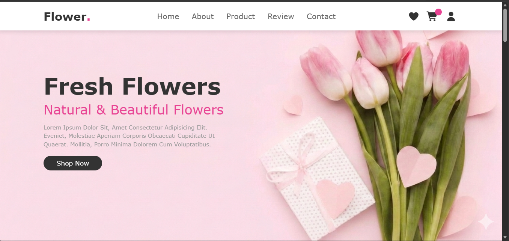

# 🌸 Responsive Flower Website

A modern and fully responsive Flower Shop website built using **HTML, CSS, and JavaScript**. This project features a beautiful UI, smooth navigation, interactive buttons, and a responsive layout that works across desktop, tablet, and mobile devices.

---

🌐 Live Demo

Visit the website: https://ayushideshwal9.github.io/responsive-flower-website/

---

## 📸 Screenshot



---

## ✨ Features

- 🌸 Fully Responsive Design
- 📱 Mobile Friendly Navigation
- 🛍️ Add to Cart Button
- ❤️ Favorite (Like) Button
- 🔢 Cart Item Counter
- 💾 Cart Count Saved (Local Storage)
- 📝 Contact Form Validation
- 🔔 Success & Error Notifications
- 🎯 Active Navigation Highlight
- ⭐ Customer Review Hover Effect
- 🎥 Background Video Section
- 🚀 Smooth Scrolling

---

## 🛠️ Technologies Used

- HTML5
- CSS3
- JavaScript (ES6)

---

## 📂 Folder Structure

```
FlowerWebsite/
│── assets/
│── index.html
│── style.css
│── script.js
│── screenshot.png
│── README.md
```

---

## 🚀 How to Run

1. Clone the repository

```bash
git clone https://github.com/ayushideshwal9/flower-website.git
```

2. Open the project folder.

3. Open `index.html` in your browser.

---

## 📚 What I Learned

- Responsive Web Design
- Flexbox
- CSS Media Queries
- DOM Manipulation
- Event Listeners
- Local Storage
- Form Validation
- Git & GitHub Workflow

---

## 📌 Future Improvements

- Product Search
- Shopping Cart Page
- Dark Mode
- Wishlist Page
- Checkout Page
- Backend Integration

---

## 👩‍💻 Author

**Ayushi Deshwal**

GitHub: https://github.com/ayushideshwal9

---

⭐ If you like this project, don't forget to give it a Star!